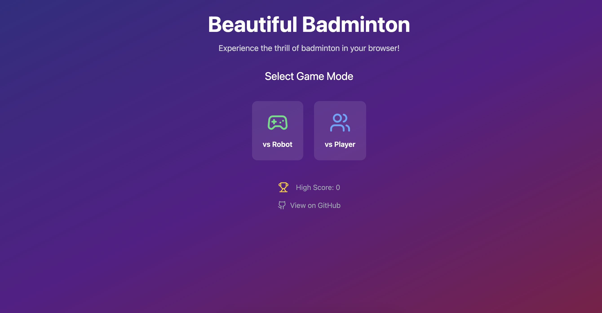

# Beautiful Badminton 🏸

A modern, interactive badminton game built with React, TypeScript, and Canvas. Play against an AI opponent or challenge a friend in local multiplayer mode!

[中文文档](README_CN.md)

## Game Preview

### Main Menu


### Gameplay


## Features

- 🎮 Two game modes: Player vs Robot and Player vs Player
- 🎨 Beautiful, responsive design with smooth animations
- 🌟 Realistic physics simulation
- 🏆 Score tracking
- 🎵 Intuitive controls and gameplay

## Getting Started

1. Clone the repository:
   ```bash
   git clone https://github.com/yourusername/beautiful-badminton.git
   ```

2. Install dependencies:
   ```bash
   cd beautiful-badminton
   npm install
   ```

3. Start the development server:
   ```bash
   npm run dev
   ```

4. Open your browser and navigate to `http://localhost:5173`

## How to Play

### Controls
- **Player 1:** Use Left and Right arrow keys
- **Player 2 (Multiplayer mode):** Use A and D keys

### Game Modes
- **vs Robot:** Challenge our AI opponent
- **vs Player:** Local multiplayer mode for two players

## Technologies Used

- React
- TypeScript
- Vite
- Framer Motion
- Tailwind CSS
- HTML5 Canvas

## Contributing

Contributions are welcome! Please feel free to submit a Pull Request.

## License

This project is licensed under the MIT License - see the LICENSE file for details.

## Acknowledgments

- Inspired by classic badminton games
- Built with modern web technologies
- Special thanks to the open-source community

---
Made with ❤️ by [Your Name]